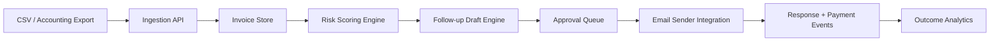

# Architecture

## System overview

## Components
- **Ingestion API**: parse imports and normalize invoice records
- **Invoice Store**: current JSON store (future Postgres)
- **Risk Scoring Engine**: overdue days + amount + contact recency
- **Follow-up Draft Engine**: deterministic template now; LLM plug-in ready
- **Approval Queue**: returns candidate drafts for human-in-the-loop send

## LLM integration path
1. Send structured context (`client_name`, `overdue_days`, `tone_policy`)
2. Generate 2 draft variants
3. Validate for policy constraints (no threats/legal language)
4. Save chosen variant + outcome events

## Reliability notes
- Keep deterministic fallback templates for model outages
- Use idempotency keys for import and send operations
- Event log every draft/send/payment update for analytics
